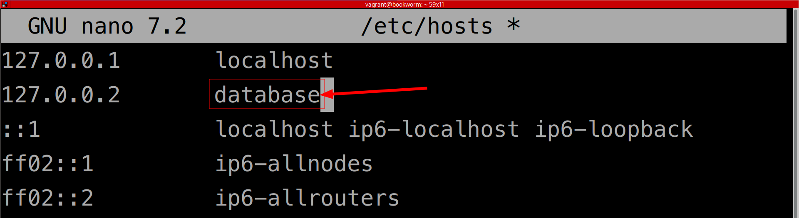
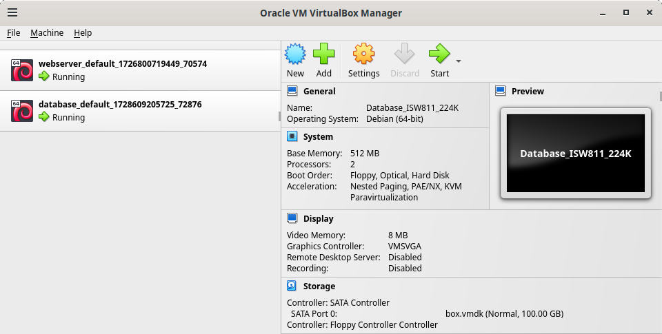

# Creando instancia de base datos con Vagrant/VirtualBox

## 1. Aprovisionar nueva instancia de Debian Bookworm

Ingresamos al folder de las máquinas _vagrant_.

```bash
cd ~/VMs
```

Creamos el directorio para la nueva máquina _vagrant_.

```bash
mkdir database
```

Ingresamos a la carpeta.

```bash
cd database
```

Creamos un nuevo _Vagrantfile_ para la nueva instancia de cómputo.

```bash
vagrant init debian/bookworm64
```

Obtendremos la siente salida:

> _A `Vagrantfile` has been placed in this directory. You are now_
> _ready to `vagrant up` your first virtual environment! Please read_
> _the comments in the Vagrantfile as well as documentation on_
> _`vagrantup.com` for more information on using Vagrant._

Editamos el _Vagranfile_ para definir la IP del nuevo equipo, para esto descomentamos la línea 35 y editamos IP.

```bash
config.vm.network "private_network", ip: "192.168.56.11"
```

En el mismo archivo _Vagranfile_, descomentamos las líneas que van de la 59 a la 65, y volvemos a comentar la 61, quedando así esta sección:

```bash
  config.vm.provider "virtualbox" do |vb|
    # Display the VirtualBox GUI when booting the machine
    # vb.gui = true
  
    # Customize the amount of memory on the VM:
    vb.memory = "1024"
  end
```

Tras haber guardado los cambios que hicimos en el _Vagrantfile_ estaremos listos para iniciar la nueva máquina por primera vez.

```bash
vagrant up
```

## 2. Cambiar el nombre de host de la nueva máquina

Nos conectamos a la nueva instancia de cómputo.

```bash
vagrant ssh
```

Al conectarnos veremos que el símbolo del sistema cambia a `vagrant@bookworm`, esto nos indica que ahora estamos conectados a la nueva instancia con nombre de host _bookworm_, con el usuario _vagrant_.

Para prevenir confusionar vamos a renombrar el host.

```bash
sudo hostnamectl set-hostname database
```

Para completar el cambio de nombre del host, actualizaremos el archivo _hosts_ de la máquina virutal.

```bash
sudo nano /etc/hosts
```

Luego de reemplazar _bookworm_ por el nuevo nombre, en este caso _database_, presionamos `[Ctrl]+O` seguido de `[Enter]` para guardar, y luego `[Ctrl]+X` para salir.



Para visualizar los cambios salimos y reingresamos a la máquina virtual.

```bash
exit
vagrant ssh
```

### 3. Instalar los paquetes de base de datos

Asegúrese de estar conectado a la máquina virtual. Su símbolo del sistema debería indicar algo como esto `vagrant@database:~$`.

Actualizamos la lista de paquetes elegibles.

```bash
sudo apt-get update
```

Procedemos a instalar MySQL con el siguiente comando de _apt_. Al lanzarlo se mostrará el mensaje _«Do you want to continue? [Y/n]»_, para aceptar los cambios presionamos `[Y]` y luego `[Enter]`, o simplemente presionamos `[Enter]` para confirmar la opción predeterminada (que es la que aparece en mayúscula).

```bash
sudo apt-get install mariadb-server mariadb-client
```

## 4. Desinstalar MySQL

Si hubiéramos instalado MySQL en otro servidor, por ejemplo, el _webserver_, procederemos a desinstalarlo.

En este punto ambas instancias deben estar en ejecución.



Asegúrese de estar conectado a la máquina virtual de _webserver_. Su símbolo del sistema debería indicar algo como esto `vagrant@webserver:~$`.

Para conectarse al _webserver_ puede salirse del servidor _database_ y navegar hasta el folder _~/VMs/webserver_ o puede abrir una segunda terminal. Cuando esté conectado a `vagrant@webserver:~$` puede ejecutar los siguientes comandos para deinstalar MySQL.

```bash
sudo apt-get remove mariadb-server
sudo apt-get autoremove
```

## 5. Crear usuario y base datos en MySQL

En este punto asegúrese de estar conectado a la máquina virtual de _database_. Su símbolo del sistema debería indicar algo como esto `vagrant@database:~$`.

Nos conectamos a MySQL como superusuario.

```bash
sudo mysql
```

Notará que el símbolo del sistema ahora se ve así `MariaDB [(none)]>`, esto significa que está conectado al CLI de MySQL.

Para verificar las bases de datos existentes.

```mysql
show databases;
```

Para crear una nueva base de datos.

```mysql
create database lfts;
```

Luego crearemos un usuario llamada _laravel_ y le asignaremos la contraseña _secret_.

```mysql
create user laravel identified by 'secret';
```

Ahora vamos a garantizarle todos los permisos al usuario _laravel_ sobre la base de datos _lfts_.

```mysql
grant all privileges on lfts.* to laravel;
```

Ahora recargamos los permisos para que los cambios surtan efecto.

```mysql
flush privileges;
```

Y salimos del CLI de MySQL.

```bash
exit
```

## 6. Comprobamos las credenciales

Para comprobar las credenciales del usuario recién creado ejecutamos el siguiente comando:

```bash
mysql -u laravel --password=secret
```

O si deseamos que se nos solicite la contraseña de manera interactiva:

```bash
mysql -u laravel -p
```

## 7. ¿Cómo recuperar la contraseña? (opcional)

Para actualizar la contraseña de un usuario en MySQL desde el CLI, puedes seguir los siguientes pasos.

1. **Acceder al cliente de MySQL**:

   Abre una terminal y accede a MySQL con privilegios de administrador (usualmente `root`):

   ```bash
   mysql -u root -p
   ```

   Esto te pedirá la contraseña del usuario `root` de MySQL.

2. **Actualizar la contraseña del usuario**:

   Una vez dentro del cliente de MySQL (`mysql>`), puedes utilizar el comando `ALTER USER` para cambiar la contraseña del usuario. Asegúrate de reemplazar `laravel` con el nombre del usuario y `nueva_contraseña` con la contraseña deseada:

   ```sql
   alter user 'laravel'@'localhost' identified by 'nueva_contraseña';
   ```

   Si el usuario accede desde cualquier host, reemplaza `'localhost'` por `'%'`:

   ```sql
   alter user 'laravel'@'%' identified by 'nueva_contraseña';
   ```

3. **Aplicar los cambios**:

   Asegúrate de ejecutar el siguiente comando para que MySQL recargue los privilegios y los cambios tengan efecto:

   ```sql
   flush privileges;
   ```

4. **Salir del cliente de MySQL**:

   ```sql
   exit;
   ```

Con estos pasos, habrás actualizado exitosamente la contraseña del usuario en MySQL.

## 8. Habilitar el acceso remoto

Para habilitar el acceso remoto a la base de datos «MariaDB» desde cualquier equipo de la red, vamos a comentar la directiva `bind-address = 127.0.0.1`, del archivo `/etc/mysql/mariadb.conf.d/50-server.cnf`, el cual podemos editar con «nano», con el siguiente comando.

```bash
sudo nano -l /etc/mysql/mariadb.conf.d/50-server.cnf
```

Recuerde que para guardar los cambios en _«nano»_, presionamos `[Ctrl]+O` seguido de `[Enter]`, y luego `[Ctrl]+X` para salir.

Para hacer efectivos los cambios reiniciamos MySQL.

```bash
sudo systemctl restart mysql
```

Para comprobar el acceso remoto, asegúrese de estar conectado a la máquina virtual de _webserver_. Su símbolo del sistema debería indicar algo como esto `vagrant@webserver:~$`.

```bash
mysql -h 192.168.56.11 -u laravel -p
```