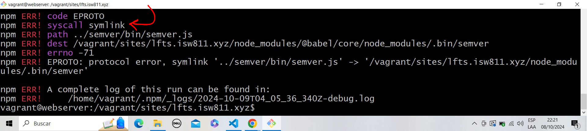

# Habilitar autenticación con Laravel/UI

## Node Version Manager

Para utilizar diferentes versiones de NodeJS en nuestro servidor web, lo más conveniente es instalar primero un gestor de versiones de Node, como _NVM-Sh_.

```bash
wget -qO- https://raw.githubusercontent.com/nvm-sh/nvm/v0.40.1/install.sh | bash
```

Para recargar el script de arranque de bash.

```bash
source ~/.bashrc
```

Ahora vamos a instalar NodeJs. En nuestro caso, como deseamos utilizarlo para trabajar en un proyecto de Laravel versión 8.6.12, debemos utilizar un release de NodeJS que haya sido liberado cerca de la fecha del lanzamiento de Laravel 8.6.12. Para este ejemplo corresponde a la versión LTS «Erbium».

```bash
nvm install --lts=erbium
```

Si en cualquier momento deseamos cambiar la versión _default_ simplemente ejecutamos el siguiente comando.

```bash
nvm alias default lts/erbium
```

## Instalar Laravel/UI

Ahora vamos a instalar _laravel/ui_. En nuestro caso, como deseamos utilizarlo para trabajar en un proyecto de Laravel versión 8.6.12, debemos utilizar un release de _laravel/ui_ que haya sido liberado cerca de la fecha del lanzamiento de Laravel 8.6.12. Para este ejemplo corresponde a la versión 3.4.6.

```bash
composer require laravel/ui:3.4.6
```

Con el comando `php artisan ui bootstrap` integramos Bootstrap con Laravel, generando las vistas y archivos necesarios para empezar a trabajar con este framework CSS.

```bash
php artisan ui bootstrap
```

Con el siguiente comando instalamos las dependencias de NodeJS de Laravel UI.

```bash
npm install && npm run dev
```

## Posibles errores

1. **Memoria RAM insuficiente**

Si la instalación de las dependencias de _NodeJS_ falla, es altamente probable que el equipo se esté quedando corto de memoria RAM. Para aumentar la memoria debemos editar el _Vagranfile_ del _webserver_. Para esto vamos a descomentar las líneas que van de la 60 a la 66, y volvemos a comentar la 62, quedando así esta sección:

```bash
  config.vm.provider "virtualbox" do |vb|
    # Display the VirtualBox GUI when booting the machine
    # vb.gui = true
  
    # Customize the amount of memory on the VM:
    vb.memory = "2048"
  end
```

Para reflejar los cambios que se hicieron en el _Vagrantfile_ para aumentar la memoria, debemos apagar la máquina virtual _webserver_ y la volver a iniciarla.

2. **Usuario no tiene permisos de crear _symlinks_ en SO anfitrión**

Otro error que podría presentarse durante la ejecución del comando `npm install`, es un relacionado con la imposibilidad de crear enlances simbólicos (symlinks).



Si usted está utilizando Windows Home Edition ejecute los que se indica en este [guion](https://github.com/mismatso/faqs-vagrant/blob/master/symlink-error.md).

Habiendo corregido los errores anteriores, reintentamos la instalación de las dependencias de NodeJS, para esto nos desplazamos al folder del proyecto de Laravel y ejecutamos los siguientes comandos.

Para desplazarnos según nuestro ejemplo, ejecute el siguiente comando.

```bash
cd /vagrant/sites/lfts.isw811.xyz/
```

Eliminamos los vestigios de la instalación fallida.

```bash
rm -rf node_modules
```

Reintentamos la instalación de las dependencias de _NodeJS_.

```bash
npm install && npm run dev
```

Para habilitar las vistas de autenticación ejecutamos el siguiente comando.

```bash
php artisan ui bootstrap --auth
```

Y nuevamente instalamos la dependencias de NodeJS.

```bash
npm install && npm run dev
```

## Conectar Laravel con base datos

Para este paso necesitares editar el archivo `.env` que se ubica en la raíz de nuestro proyecto de _Laravel_.

```bash
DB_CONNECTION=mysql
DB_HOST=192.168.56.11
DB_PORT=3306
DB_DATABASE=lfts
DB_USERNAME=laravel
DB_PASSWORD=secret
```

Luego nos conectamos nuevamente al _webserver_, nos desplazamos hasta el folder que contiene el sitio _Lavel_ y ejecutamos el siguiente comando, para ejecutar las migraciones de base de datos.

```bash
php artisan migrate
```

En este punto pueden abrir su navegador y visitar el sitio, en la esquina superior derecha verá las nuevas opciones de _Login_ y _Register_. Intenten registrar un usuario para verificar que su aplicación está correctamente conectada a base de datos.
