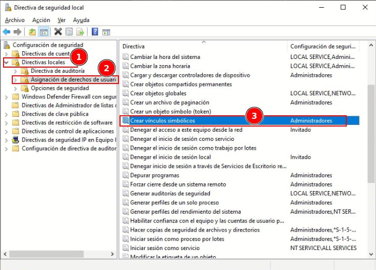
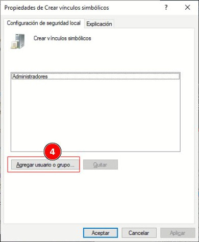
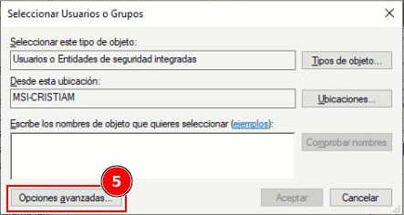
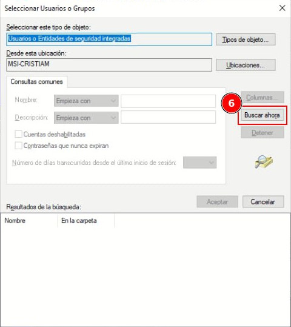
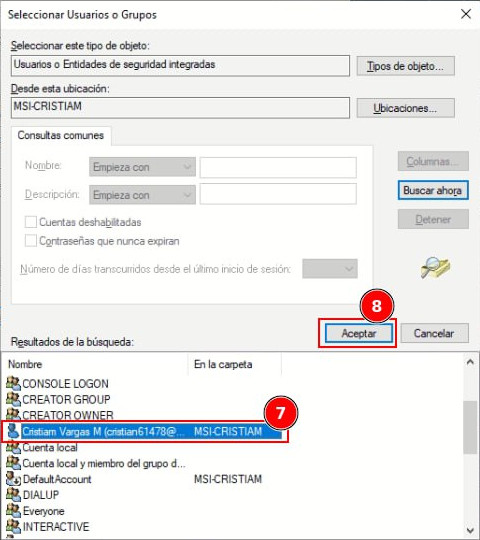
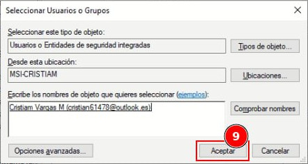
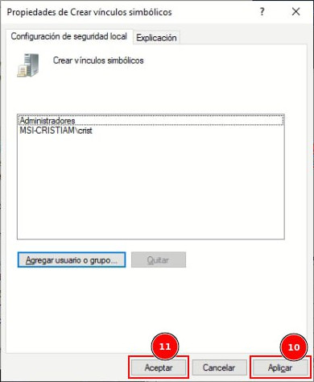

[⬅ Volver al índice](/Readme.md)

# **Error de Symlink en Windows**

Cuando utilizamos _Vagrant_ para virtualizar sistemas operativos tipo GNU/Linux sobre Windows 7, 8, 10, 11, etc., puede presentarse un error cuando herramientas como _NPM_ intentan crear enlaces simbólicos (symlinks) al momento de instalar dependencias. Esto ocurre debido a que Windows, por defecto, no permite a los usuarios sin privilegios administrativos crear symlinks. A continuación, se explican los pasos para habilitar esta funcionalidad en ediciones de Windows como _Home Edition_, que no incluyen ciertas herramientas administrativas por defecto.


## **Paso 1 — Habilitar el editor de políticas de seguridad en «Windows Home Edition»**

Si usted utiliza Windows 7, 8, 10, 11, etc., en cualquiera de sus versiones _Home Edition_, debe seguir estos pasos para habilitar el editor de políticas de seguridad local.

### Habilitar _Local Security Policy_ (`secpol.msc`)

La herramienta _«Local Security Policy»_ (`secpol.msc`), necesaria para autorizar a su usuario la creación de symlinks, no está disponible por defecto en las ediciones _Home_ de Windows. Sin embargo, es posible habilitarla utilizando el siguiente procedimiento.

1. **Abra una terminal CMD como administrador**: Haga clic con el botón derecho sobre el icono de CMD y seleccione "Ejecutar como administrador".
   
2. **Ejecute el siguiente comando** para agregar los componentes del sistema que permiten habilitar la herramienta:

    ```cmd
    FOR %F IN ("%SystemRoot%\servicing\Packages\Microsoft-Windows-GroupPolicy-ClientTools-Package~*.mum") DO (DISM /Online /NoRestart /Add-Package:"%F")
    ```

   Este comando utiliza _DISM_ (Deployment Image Servicing and Management) para instalar el paquete de herramientas de políticas de grupo, que incluye el editor _secpol.msc_. 

3. **Ejecute el segundo comando** para añadir la extensión que soporta las políticas de grupo:

    ```cmd
    FOR %F IN ("%SystemRoot%\servicing\Packages\Microsoft-Windows-GroupPolicy-ClientExtensions-Package~*.mum") DO (DISM /Online /NoRestart /Add-Package:"%F")
    ```

   Este segundo comando agrega las extensiones necesarias para que las políticas de grupo funcionen correctamente en su sistema.

4. **Reinicie su equipo**: Después de ejecutar los comandos anteriores, es necesario reiniciar su equipo para que los cambios surtan efecto y la herramienta _Local Security Policy_ esté disponible.

## **Paso 2 — Otorgar permisos para crear _Symlinks_**

Una vez habilitada la herramienta _Local Security Policy_ (`secpol.msc`), siga los pasos siguientes para otorgar a su usuario permisos para crear symlinks.

1. **Abra el editor de políticas de seguridad local**: Presione `Win + R`, escriba `secpol.msc` y presione `Enter`. 

   

2. En el menú del lado izquierdo, navegue hasta la sección de «Directivas locales» y luego seleccione «Asignación de derechos de usuario».

3. Busque la política «Crear vínculos simbólicos» y haga doble clic sobre ella.

   

4. Haga clic en «Agregar usuario o grupo».

   

5. En la ventana emergente, haga clic en «Opciones avanzadas».

   

6. Haga clic en «Buscar ahora» para listar los usuarios disponibles.

   

7. Seleccione su nombre de usuario o el del usuario al que desea otorgar permisos y haga clic en «Aceptar».

   

8. Confirme la selección haciendo clic en «Aceptar».

   

9. Finalmente, confirme los cambios haciendo clic en «Aplicar» y luego en «Aceptar».

   

Con estos pasos, habrá habilitado la creación de enlaces simbólicos para su usuario en Windows _Home Edition_. Esta funcionalidad es especialmente útil para desarrolladores que trabajan con herramientas como _NPM_ y _Vagrant_, las cuales a menudo requieren la creación de symlinks para la correcta instalación de dependencias.