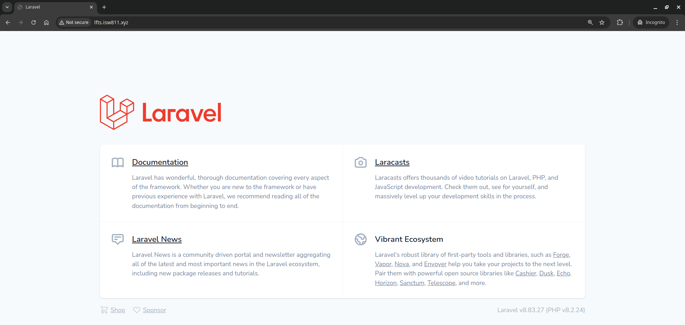

[⬅ Volver al índice](/Readme.md)

# **Habilitar un virtual host para LFTS (Laravel From The Scratch)**

En este guion vamos a crear un sitio web con la plantilla de Laravel 8.6.12, y la publicaremos en nuestro servidor web con el dominio _lfts.isw811.xyz_.

## 1. **Conectarse a la instancia de _webserver_**

Primero, nos dirigimos al directorio donde se alojan las máquinas _Vagrant_ y accedemos al directorio de la instancia del servidor web.

```bash
cd ~/VMs/webserver
```

Iniciamos la máquina virtual.

```bash
vagrant up
```

Luego, nos conectamos a la instancia del servidor web.

```bash
vagrant ssh
```

## 2. **Ahora vamos a _craftear_ el nuevo sitio Laravel 8.6.12**

Primero nos movemos al directorio _sites_, en la ruta que el usuario Vagrant sí tiene permisos de escritura. Esto es haciendo referencia a que la carpeta _sites_ también está montada en _/home/vagrant/sites_, pero ahí solamente Apache tiene permisos de escritura.

```bash
cd /vagrant/sites
```

Ahora utilizando _Composer_ vamos a crear un nuevo sitio con la plantilla de Laravel 8.6.12.

```bash
composer create-project laravel/laravel:8.6.12 lfts.isw811.xyz
```

### Errores conocidos

Si durante la creación del proyecto con _Composer_ les da el siguiente error (ver imagen), es que la conexión está lenta y se está excediendo el tiempo de espera, deben aumentarlo y reintentar.


Para solucionarlo pueden aumentar el tiempo de espera, así:

```bash
composer --global config process-timeout 2000
```

## 3. Desplegar el sitio _lfts.isw811.xyz_ como un _Virtual Host_ de Apache

### 6.1. Crear el archivo de configuración del _Virtual Host_

Desde la carpeta _confs_, creamos un archivo de configuración para el sitio _lfts.isw811.xyz_. Esto lo hacemos desde la máquina anfitriona, asumiendo que estás en el folder _webserver_.

```bash
cd confs
touch lfts.isw811.xyz.conf
```

Editamos el archivo de configuración:

```bash
code lfts.isw811.xyz.conf
```

Añadimos lo siguiente:

```apache
<VirtualHost *:80>
ServerAdmin webmaster@lfts.isw811.xyz
ServerName lfts.isw811.xyz

DirectoryIndex index.php index.html
DocumentRoot /home/vagrant/sites/lfts.isw811.xyz/public

<Directory /home/vagrant/sites/lfts.isw811.xyz/public>
    AllowOverride All
    Require all granted
</Directory>

ErrorLog ${APACHE_LOG_DIR}/lfts.isw811.xyz.error.log
CustomLog ${APACHE_LOG_DIR}/lfts.isw811.xyz.access.log combined
</VirtualHost>
```

### 6.2. Desplegar el nuevo _Virtual Host_

Nos conectamos al servidor web y habilitamos el soporte para _Virtual Hosts_. Si esto ya lo habías hecho antes puedes omitir este paso.

```bash
sudo a2enmod vhost_alias
sudo systemctl restart apache2
```

Copiamos el archivo de configuración al directorio de sitios disponibles.

```bash
sudo cp /vagrant/confs/lfts.isw811.xyz.conf /etc/apache2/sites-available/
```

Habilitamos el nuevo sitio.

```bash
sudo a2ensite lfts.isw811.xyz.conf
```

Verificamos la configuración de Apache.

```bash
sudo apache2ctl -t
```

Si aparece el error _Could not reliably determine the server's fully qualified domain name_, agregamos la directiva _ServerName_. Si este error ya había sido solucionado en un ejercicio anterior debes omitir este paso.

```bash
echo "ServerName webserver" | sudo tee -a /etc/apache2/apache2.conf
```

Si no hay errores, reiniciamos Apache.

```bash
sudo systemctl restart apache2
```

Ahora, visitamos [http://lfts.isw811.xyz](http://lfts.isw811.xyz) desde la máquina anfitriona para ver el sitio desplegado.

