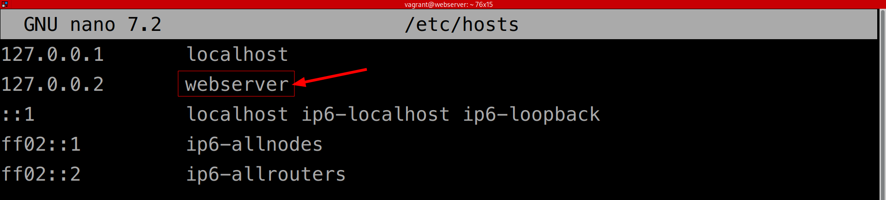
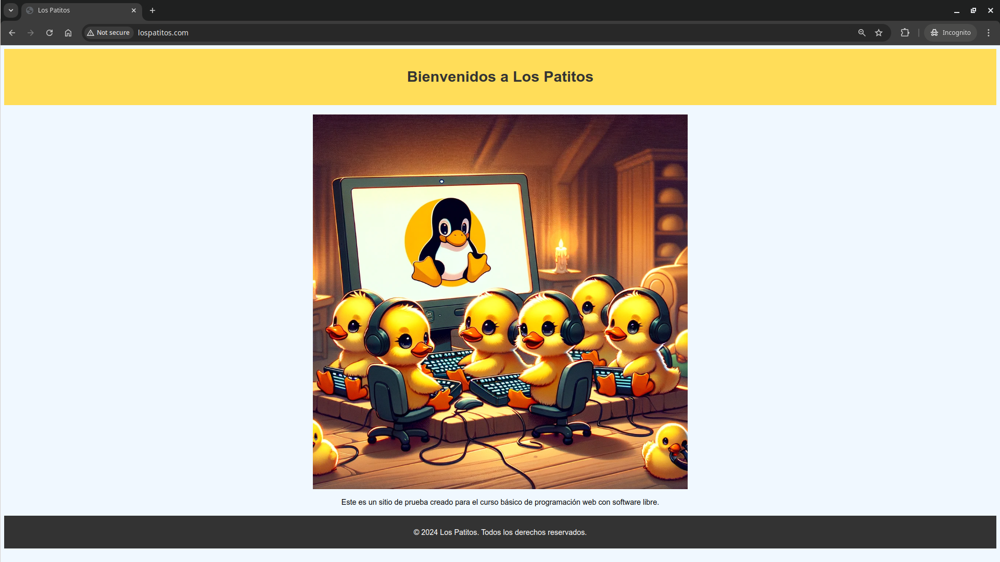

# Creando instancia de Webserver con Vagrant/VirtualBox

## 1. **Aprovisionar nueva instancia de Debian Bookworm**

Ingresamos al directorio donde se alojarán las máquinas _Vagrant_.

```bash
cd ~/VMs
```

Creamos el directorio para la nueva máquina _Vagrant_, y de una vez creamos los folders que albergarán los sitios web y los archivos de configuración de los _Virtual Host_ de Apache2.

```bash
mkdir -p webserver/sites
mkdir -p webserver/confs
```

Ingresamos a la carpeta creada.

```bash
cd webserver
```

Creamos un nuevo _Vagrantfile_ para la nueva instancia de cómputo.

```bash
vagrant init debian/bookworm64
```

Obtendremos la siente salida:

> _A `Vagrantfile` has been placed in this directory. You are now_
> _ready to `vagrant up` your first virtual environment! Please read_
> _the comments in the Vagrantfile as well as documentation on_
> _`vagrantup.com` for more information on using Vagrant._

Editamos el _Vagranfile_ para definir la IP del nuevo equipo, para esto descomentamos la línea 35 y editamos IP.

```bash
config.vm.network "private_network", ip: "192.168.56.10"
```

En el mismo archivo _Vagranfile_, debajo de la línea 46 agregamos la siguiente directiva, la cual nos permitirá montar la subcarpeta _«sites»_ en una segunda ubicación, específicamente _/home/vagrant/sites_, con la diferencia de que esta ubicación el _«sites»_ tendrá como propietario y como grupo a _www-data_, que corresponde al usuario de Apache2. Esto es para que Apache tengo total control de ese folder en tiempo de ejecución de los sitios.

```bash
config.vm.synced_folder "sites/", "/home/vagrant/sites", owner: "www-data", group: "www-data"
```

En el mismo archivo _Vagranfile_, descomentamos las líneas que van de la 59 a la 65, y volvemos a comentar la 61, para asignarle 2 GB de RAM al servidor web, quedando así esta sección:

```bash
  config.vm.provider "virtualbox" do |vb|
    # Display the VirtualBox GUI when booting the machine
    # vb.gui = true
  
    # Customize the amount of memory on the VM:
    vb.memory = "2024"
  end
```

Una vez guardados los cambios en el _Vagrantfile_, estamos listos para iniciar la nueva máquina.

```bash
vagrant up
```

## 2. **Cambiar el nombre de host de la nueva máquina**

Nos conectamos a la nueva instancia de cómputo.

```bash
vagrant ssh
```

Al conectarnos veremos que el símbolo del sistema cambia a `vagrant@bookworm`, esto nos indica que ahora estamos conectados a la nueva instancia con nombre de host _bookworm_, con el usuario _vagrant_.

Para evitar confusiones, vamos a cambiar el nombre del host.

```bash
sudo hostnamectl set-hostname webserver
```
Para completar el cambio, actualizamos el archivo _hosts_ de la máquina virtual.

```bash
sudo nano /etc/hosts
```

Luego de reemplazar _bookworm_ por el nuevo nombre, en este caso _webserver_, presionamos `[Ctrl]+O` seguido de `[Enter]` para guardar, y luego `[Ctrl]+X` para salir.



Para verificar los cambios, salimos y volvemos a conectarnos a la máquina virtual.

```bash
exit
vagrant ssh
```

## 3. **Instalar los paquetes de servidor web**

Asegúrese de estar conectado a la máquina virtual. Su símbolo del sistema debería indicar algo como esto `vagrant@webserver:~$`.

Actualizamos la lista de paquetes elegibles.

```bash
sudo apt-get update
```

Procedemos a instalar MySQL con el siguiente comando de _apt_. Al lanzarlo se mostrará el mensaje _«Do you want to continue? [Y/n]»_, para aceptar los cambios presionamos `[Y]` y luego `[Enter]`, o simplemente presionamos `[Enter]` para confirmar la opción predeterminada (que es la que aparece en mayúscula).

```bash
sudo apt-get install vim vim-nox curl apache2 mariadb-client php8.2 php8.2-curl php8.2-bcmath php8.2-mysql php8.2-mcrypt php8.2-xml php8.2-zip php8.2-mbstring
```

Para visualizar el sitio por defecto de Apache desde la máquina anfitriona visitamos la URL [http://192.168.56.10](http://192.168.56.10).

## 4. **Agregar entradas la archivo _hosts_**

Cuando deseamos simular la resolución de un dominio hacía nuestro servidor web, debemos agregar una o más entradas al archivo hosts de la máquina anfitriona.

En los sistemas operativos tipo Windows, el archivo «hosts» se encuentra en la ruta _c:\Windows\System32\drivers\etc_. Desde un cmd ejecutado como administrador, se puede editar de la siguiente manera.

```dos
cd \Windows\System32\drivers\etc
notepad hosts
```

En los sistemas operativos tipo Unix, el archivo «hosts» se encuentra en la
ruta `/etc/hosts`. Desde bash se puede editar de la siguiente manera.

```bash
sudo nano /etc/hosts
```

En el archivo _«hosts»_ agregamos la entrada correspondiente para simular la resolución del dominio deseado. El resto de entradas que puedan existir en el archivo no se modifican.

En este ejemplo, vamos a agregar una entrada para simular el dominio _lospatitos.com_.

```dos
192.168.56.10 lospatitos.com
```

## 5. *Crear el sitio de prueba de lospatitos.com*

Estando ubicado en la carpeta _webserver_ (desde la máquina anfitrión), vamos a crear una carpeta para el sitio web _lospatitos.com_, de la misma manera podemos crear carpetas para albergar otros sitios.

```bash
cd sites
mkdir lospatitos.com
cd lospatitos.com
```

Ahora vamos a crear el contenido de este sitio de prueba.

```bash
cd lospatitos.com
mkdir assets
mkdir images
touch assets/styles.css
touch index.html
```

Para descargar la imagen que se utiliza en el sitio de prueba utilice los siguiente comando.

```bash
curl -o ./images/lospatitos.webp https://coding-rs.s3.amazonaws.com/images/lospatitos/lospatitos.webp
```

Ahora puede editar el archivo _index.html_, con `code index.html`, el cual deberá contener el siguiente código.

```html
<!DOCTYPE html>
<html lang="es">
<head>
    <meta charset="UTF-8">
    <meta name="viewport" content="width=device-width, initial-scale=1.0">
    <title>Los Patitos</title>
    <link rel="stylesheet" href="assets/styles.css">
</head>
<body>
    <header>
        <h1>Bienvenidos a Los Patitos</h1>
    </header>
    <main>
        <section>
            
            <p>Este es un sitio de prueba creado para el curso básico de programación web con software libre.</p>
        </section>
    </main>
    <footer>
        <p>&copy; 2024 Los Patitos. Todos los derechos reservados.</p>
    </footer>
</body>
</html>
```

Ahora puede editar el archivo _styles.css_, con `code assets/styles.css`, el cual deberá contener el siguiente código.

```css
body {
    font-family: Arial, sans-serif;
    text-align: center;
    background-color: #f0f8ff;
}

header {
    background-color: #ffdd59;
    padding: 20px;
}

h1 {
    color: #333;
}

main {
    margin: 20px auto;
    max-width: 800px;
}

img {
    max-width: 100%;
    height: auto;
}

footer {
    background-color: #333;
    color: #fff;
    padding: 10px;
}
```

## 6. *Desplegar el sitio _lospatitos.com_ como un virtual host de Apache*

### 6.1. *Crear el archivo .conf del vhost*

Estando ubicado en la carpeta _webserver_ (desde la máquina anfitrión), vamos a ingresar al folder _confs_ (creado un paso anterior), y ahí vamos a crear un archivos de configuración _(.conf)_ por cada sitio web que deseamos albergar en nuestro servidor web.

Por convención, cada archivo _.conf_ deberá tener por nombre el dominio que se desea hospedar, terminando con la extensión _.conf_, en el caso de _lospatitos.com_ el archivo _.conf_ quedaría así.

```bash
cd confs
touch lospatitos.com.conf
```

Ahora puede editar el archivo _lospatitos.com.conf_, con `code lospatitos.com.conf`, el cual deberá contener el siguiente código.


```bash
<VirtualHost *:80>
ServerAdmin webmaster@lospatitos.com
ServerName lospatitos.com

# Indexes + Directory Root.
DirectoryIndex index.php index.html
DocumentRoot /home/vagrant/sites/lospatitos.com

<Directory /home/vagrant/sites/lospatitos.com>
    DirectoryIndex index.php index.html
    AllowOverride All
    Require all granted
</Directory>

ErrorLog ${APACHE_LOG_DIR}/lospatitos.com.error.log
LogLevel warn
CustomLog ${APACHE_LOG_DIR}/lospatitos.com.access.log combined
</VirtualHost>
```

### 6.2. *Desplegar nuevo _virtual host_*

Para desplegar nuestro nuevo sitio web _lospatitos.com_ como un _virtual host_ de Apache, debemos conectarlos al servidor web y ejecutar los siguientes pasos.

Habilitar el módulo para soportar _virtual hosts_ (esto solo deberá hacerse la primera vez, para futuros vhosts no será necesario).

```bash
sudo a2enmod vhost_alias
sudo systemctl restart apache2
```

Copiar el archivo _.conf_ al directorio de sitios disponibles de Apache2.

```bash
sudo cp /vagrant/confs/lospatitos.com.conf /etc/apache2/sites-available/
```

Habilitar el nuevo sitio.

```bash
sudo a2ensite lospatitos.com.conf
```

Verificar que con el nuevo _.conf_ no se haya introducido ningún error a la configuración de Apache. Esto importante hacerlo antes de reiniciar Apache, para prevenir que una configuración defectuosa impida el inicio de Apache, comprometiendo la disponibilidad de otros sitios que tengamos en el mismo servidor.

```bash
sudo apache2ctl -t
```

Si al ejecutar `sudo apache2ctl -t` obtenemos el error _Could not reliably determine the server's fully qualified domain name_, debemos ejecutar el siguiente comando, para agregar la directiva «SeverName» al archivo de configuración general de Apache.

```bash
echo "ServerName webserver" | sudo tee -a /etc/apache2/apache2.conf
```

Si no hay más errores, estamos listo para reiniciar Apache2.

```bash
sudo systemctl restart apache2.service
```

Para visualizar el nuevo sitio desde la máquina anfitriona visitamos la URL [http://lospatitos.com](http://lospatitos.com) (o el nombre de dominio que corresponda). Ahora en lugar del sitio predeterminado cargará el nuevo sitio.

